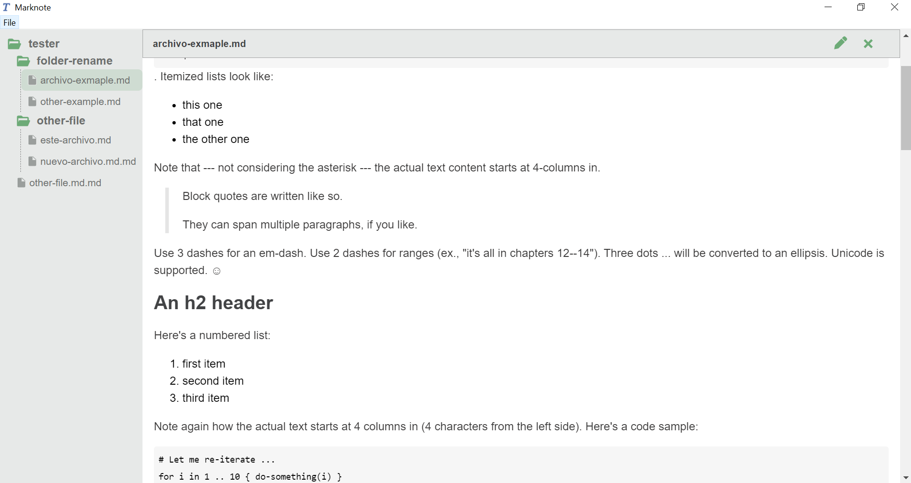
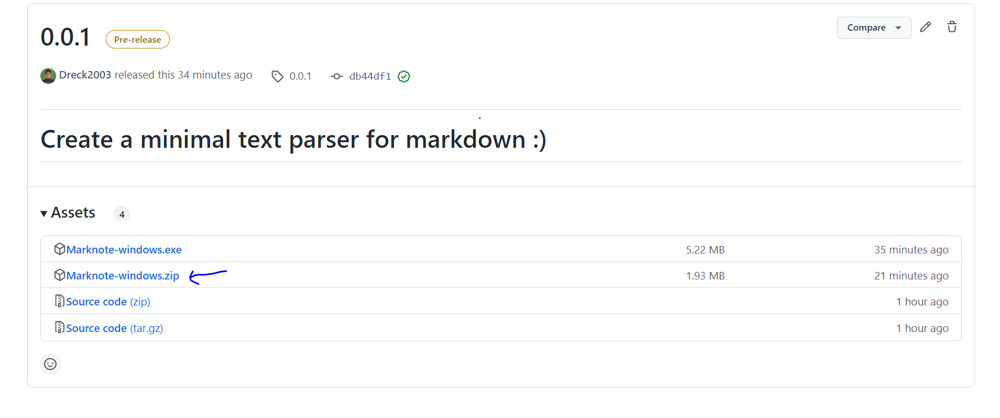

# Marknote

**Marknote** is a small markdown editor 📔.





### Sections

 - [Download](#download)

<br>

## Download

For download **Marknote**, have two ways:

 - **Cloning this repository** and build manually:

```
  - git clone https://github.com/Dreck2003/Marknote/tree/main  
  - yarn tauri build --> This command should build app 
  according to Operating System
```

 - **Download from releases** :

```
 - Go to: https://github.com/Dreck2003/Marknote/releases/tag/0.0.1
 - Download the package according to SO 
 (for now only have for windows 😪)
```



